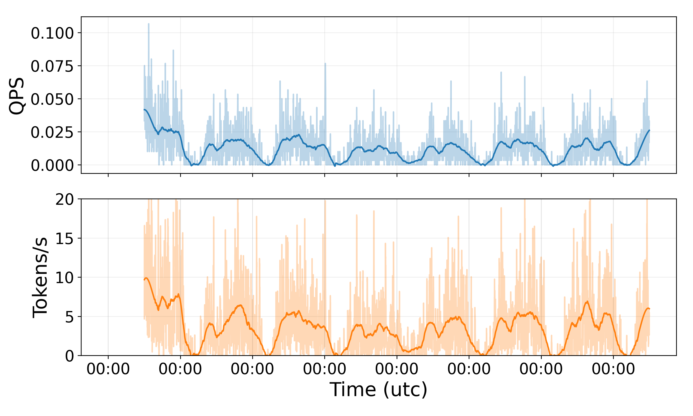
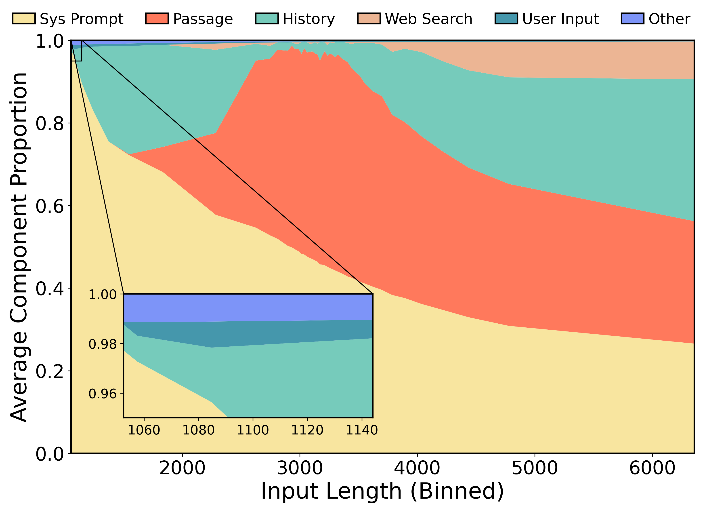
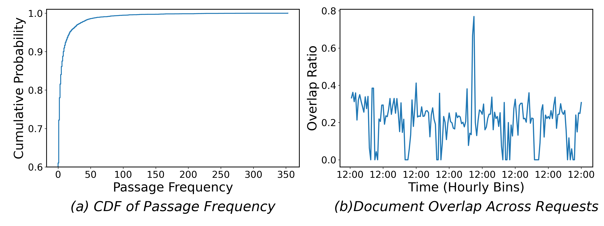

<div align="center">
  
  <h3 align="center">
      A Real-World RAG Workload Trace to Optimize RAG Serving Systems
  </h3>
  <a href="https://arxiv.org/pdf/2511.xxxxx.pdf" target="_blank"><strong>📃 Technical Report</strong></a>
</div>
<br/>

**Navigation**: [Overview](#overview) | [How to use](#how-to-use) | [Components](#components) | [Data Overview](#data-overview) | [Significance](#significance) | [Citiation](#citiation)

---

RAGPulse is a real-world RAG workload trace collected from an university-wide Q&A service scenario. The system has been serving over 40,000 students and faculties since April 2024, providing intelligent policy Q&A services. The trace contains a total of **7,106** records entries, sampled from one week of our Q&A service.

**[FUTURE PLAN]**
- The conversation log, including `Execution Time per Component`, `Attached file content`, `Internal LLM Request/Response Logs`, etc, will be soon added.
- Traces based on `Agent workflows` are currently under development.

<!-- <details> -->
# Overview

**There are currently 6 files in [data](https://github.com/right135/RAGPulse/tree/main/data)**

- `0_trace.jsonl` contains the key information of our trace. Totally 7,106 lines.
- `1_sys_prompt.jsonl` contains the hash_ids corresponding to the system prompt content and the length of the token corresponding to the hash_ids. Totally 6,898 lines.
- `2_passages.jsonl` contains the hash_ids corresponding to vector database, which holds a total of 8,302 lines of passages content, and the length of the token corresponding to the hash_ids.
- `3_history.jsonl` contains the hash_ids corresponding to user's 4,910 lines chat history content, and the length of the token corresponding to the hash_ids.
- `4_user_input.jsonl` contains the hash_ids corresponding to the question entered by the user content, which holds a total of 6,292 chunk hash_ids, and the length of the token corresponding to the hash_ids.
- `5_web_search.jsonl` contains the hash_ids corresponding to content retrieved online content, and the length of the token corresponding to the hash_ids.

<!-- </details> -->

<!-- <details> -->
# How to use

**1. Prepare Environment**

- Clone this repo
```sh
git clone https://github.com/flashserve/RAGPulse.git
```

- Install requirments in a new venv, just run

```sh
conda create -n myenv python=3.12 -y
conda activate myenv
pip install vllm==0.6.2
conda install conda-forge::pyairports
```

**2. Path Configuration**

Configure the trace and model paths in the get_args() function within the main.py file.

**3. Execution**

```sh
cd example/single_online_instance
bash start.sh
python main.py
```

**4.1 Expected Output**
The script will log events and metrics during the workload replay process. Your numbers will differ slightly depending on GPU model, driver, and system load. Example output:
```
【INFO】2025-11-12 05:00:18   logger.py:138  Arguments: Namespace(api_key='dummy_key', api_base='http://0.0.0.0:8000/v1', model_name='Qwen2.5-14B-Instruct', trace_dir='/home/TwenWorkload/trace', log_dir='/home/TwenWorkload/example/single_online_instance/logs', time_scale_factor=10, use_trace_num=5, tokenizer_path='/home/share/models/Qwen2.5-14B-Instruct', streaming=True)
【INFO】2025-11-12 05:00:18   logger.py:138  RAG Pulse Online Instance Logger initialized.
【INFO】2025-11-12 05:00:18   logger.py:138  Preprocessing traces and hash_ids...
【INFO】2025-11-12 05:00:19   logger.py:138  Loaded 7106 traces from 0_trace.jsonl.
【INFO】2025-11-12 05:00:19   logger.py:138  Loaded vocab size: 151643 from /home/share/models/Qwen2.5-14B-Instruct/vocab.json.
【INFO】2025-11-12 05:00:24   logger.py:138  Loaded 26924 hash_ids from ['1_sys_prompt.jsonl', '2_passages.jsonl', '3_history.jsonl', '4_user_input.jsonl', '5_web_search.jsonl'].
【INFO】2025-11-12 05:00:33   logger.py:138  Preprocessed 5 traces.
【INFO】2025-11-12 05:00:33   logger.py:138  Initializing OnlineServer...
【INFO】2025-11-12 05:00:33   logger.py:138  OnlineServer initialized.
【INFO】2025-11-12 05:00:33   logger.py:138  Starting workload replay...
【INFO】2025-11-12 05:00:33   logger.py:138  Starting simulation of real-time requests...
【INFO】2025-11-12 05:00:41   logger.py:138  Sent request at time 8.20s with input_text length 15792 and original scaling timestamp 8.2.
```
**4.2 Expected Results**
- Logs: Logs will be saved in the logs/ directory.
- Metrics: Metrics (TTFT and TPOT) will be saved in the metrics/ directory in a JSON file.
- Console Output: Real-time logging of events and metrics during workload replay.

**For more details, click [here](example/single_online_instance/README.md)**.

<!-- </details> -->

<!-- <details> -->
# Components

```json
{   "timestamp": "27", 
    "input_length": 3861, 
    "output_length": 127, 
    "hash_ids": {
        "sys_prompt": [8325, 8326, 11575], 
        "passages_ids": [6123, 7239, 6124, 1167, 7250, 5448], 
        "history": [15215], 
        "web_search": [20319, 20320], 
        "user_input": [23648]
        }, 
    "session_id": "1758081660427-xa8rbsd2uco1"
}
```

The above shows **one example** from **RAGPulse**. All textual content has been replaced with remapped hash IDs for user privacy. The detailed structure of the trace is as follows:

- `timestamp`: The request submission time,in seconds, measured from the beginning of the trace (12:00:00).
- `input_length`: Total token length of the request, including the system prompt, retrieved passages, chat history, web search, user input, and so on.
- `output_length`: Total token length of the output.
- `hash_ids`: A comprehensive collection of hash identifiers representing every component of the request's input. This includes unique IDs for the system prompt, all retrieved documents, user chat history, external web search results,and user's question.
- `session_id`: The conversation identifier to which the request belongs.

<!-- </details> -->

# Data Overview

<div align="center">
  <br>

  *Figure 1: Throughput over time in RAGPulse. This figure shows the distribution of user activity patterns over a one-week period.*<br> 

</div>


<div align="center">
  <br>

  *Figure 2: Proportion of Input Components Across Different Input Lengths in RAGPulse. The system prompt length remains relatively fixed, with proportion changes primarily driven by variations in the length of other components.*<br>

</div>

<div align="center">
  <br>
  
  <em>Figure 3: Partially Unique Characteristics of RAG Traces in RAGPulse. The usage frequency and overlap ratio of different corpus chunks exhibit significant differences.</em>

</div>

<!-- <details> -->
# Significance

<details><summary><strong>Why we need a RAG-Specific trace?</strong></summary>
<br>

- **Multi-Stage Pipeline Complexity**<br>Unlike pure LLM inference traces, RAG involves retrieval, reranking, and generation stages. The latency, resource usage, and caching patterns are jointly influenced by these multi-step interactions — something existing LLM traces cannot capture.
- **Knowledge-Dependent Workload Dynamics**<br>RAG performance depends heavily on the underlying vector database and query patterns. Query similarity, embedding cache hit rate, and retrieval latency all vary with real-world user behavior — which must be reflected in a dedicated trace.
- **Cross-Request Context Dependency**<br>In many RAG services (e.g., campus QA or document understanding), consecutive queries are often semantically related or share similar knowledge needs. Capturing this inter-request correlation is critical for optimizing KV cache reuse, batching, and scheduling.
- **Retrieval-Serving Co-Optimization Need**<br>A RAG trace enables joint optimization of both retrieval and generation components, rather than treating them as independent black boxes. This helps design better serving systems, such as dynamic retrieval caching or query-adaptive batching.
- **Bridging Research and Real-World Deployment**<br>Existing LLM traces are mostly from synthetic or general-purpose chat workloads. A RAG-specific trace provides grounded insights for RAG system design, cost-performance tradeoffs, and scheduling strategies in real deployments.
</details>

<details><summary><strong>What can we do with this RAG trace?</strong></summary>
<br>

- **System Performance Analysis**
Study end-to-end latency breakdown across retrieval, ranking, and generation stages.
- **Scheduling and Caching Optimization**
Evaluate KV cache reuse, adaptive batching, and retrieval caching under real correlation patterns.
- **Retrieval Quality and Cost Tradeoff**
Explore how retrieval depth, embedding model, and DB latency affect overall service cost and quality.
- **Workload Modeling and Simulation**
Build realistic RAG simulators or benchmarks for academic or industrial RAG system evaluation.
- **Agent Evaluation Studies**
Track how real-world RAG workloads evolve toward agent-style reasoning and multi-turn task-solving.

</details>

<!-- </details> -->

<!-- <details> -->
# Citiation

Please kindly cite our paper if you find the paper or the trace is useful:

```bibtex
@article{
}
```

<!-- </details> -->

